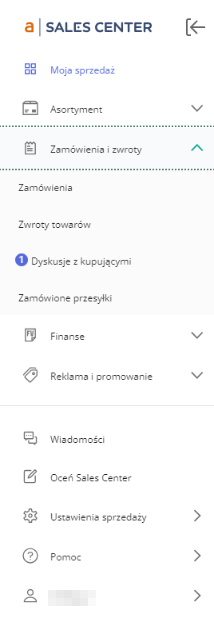

## Usprawnienia Sales Center Lite
To rozszerzenie to uproszczona wersja rozszerzenia "Usprawnienia Sales Center", kopiująca jedynie licznik wiadomości i wiadomości w dyskusjach z ikony na górnej belce do ikony w menu bocznym.

Jest to rozszerzenie do przeglądarki Chrome. Wszystkie rozszerzenia testuję tylko dla systemu Windows 10 i najnowszej wersji przeglądarki.

**Instrukcja instalacji:**
1. Pobierz rozszerzenie "sales_center_improvements_lite.zip" z listy plików widocznej powyżej i rozpakuj je tam gdzie zamierzasz je trzymać.
2. Kliknij ikonę menu rozszerzeń w prawym górnym rogu okna przeglądarki (ikona puzzla)  lub z menu przeglądarki wybierz "Rozszerzenia - Zarządzaj rozszerzeniami".
3. Włącz "Tryb dewelopera" w prawym górnym rogu okna przeglądarki 
4. Kliknij przycisk "Załaduj rozpakowane"  

5. Wybierz folder z uprzednio pobranym i rozpakowanym rozszerzeniem.
6. Jeżeli miałeś otwartą stronę "Sales Center", odśwież ją celem załadowania rozszerzenia.

To wszystko. Rozszerzenie będzie obserwować ikonę wiadomości na górze strony, jeśli pojawi się licznik wiadomości przy pozycji "Wiadomości" lub "Dyskusje" zostanie on wyświetlony również przy odpowiedniej ikonie w menu bocznym (w menu bocznym nie ma ikony odpowiadającej dyskusjom, jest tylko podmenu "Dyskusje z kupującymi" która jest domyślnie zwinięta w menu, tak więc licznik pojawi się przy ikonie "Zamówienia i zwroty", po rozwinięciu tego menu pojawi się przy podmenu "Dyskusje z kupującymi").

Pamiętaj - Sales Center jest w trakcie ciągłych zmian konstrukcyjnych, dlatego rozszerzenie może w każdej chwili przestać spełniać swoje zadanie, jednak sam korzystam z większości moich rozszerzeń na co dzień więc w razie czego będę starał się przywrócić funkcjonalność tak szybko jak to możliwe.

***
Jeżeli napotkasz jakieś błędy w trakcie działania aplikacji, masz jakieś pytania, sugestie, problemy z obsługą, daj znać w sekcji "Discussions".
Jeżeli podoba Ci się moja praca i chcesz aby była dalej rozwijana, możesz wesprzeć mnie dotacją na dowolną kwotę przez PayPal (nie ma potrzeby posiadania konta PayPal): [przekaż donację](https://www.paypal.com/donate/?hosted_button_id=GVU3UC2ZY85SN&locale.x=pl_PL)
